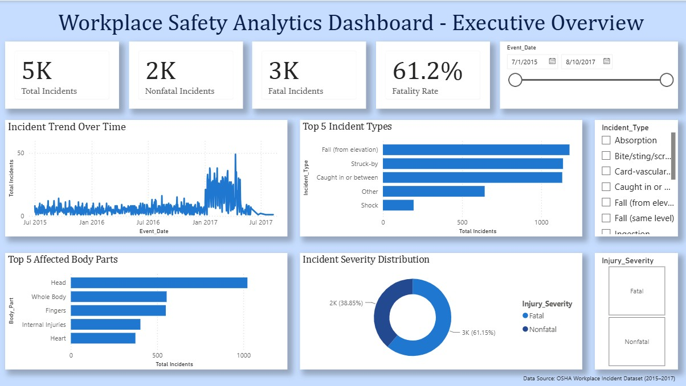
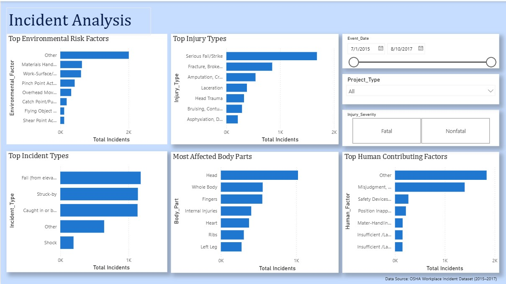
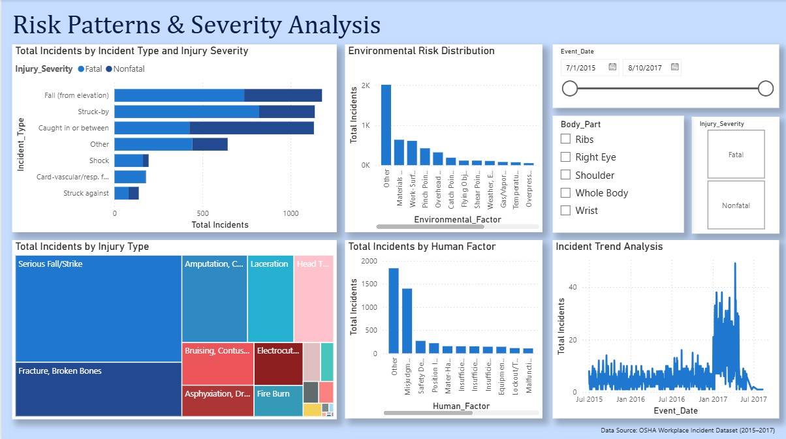
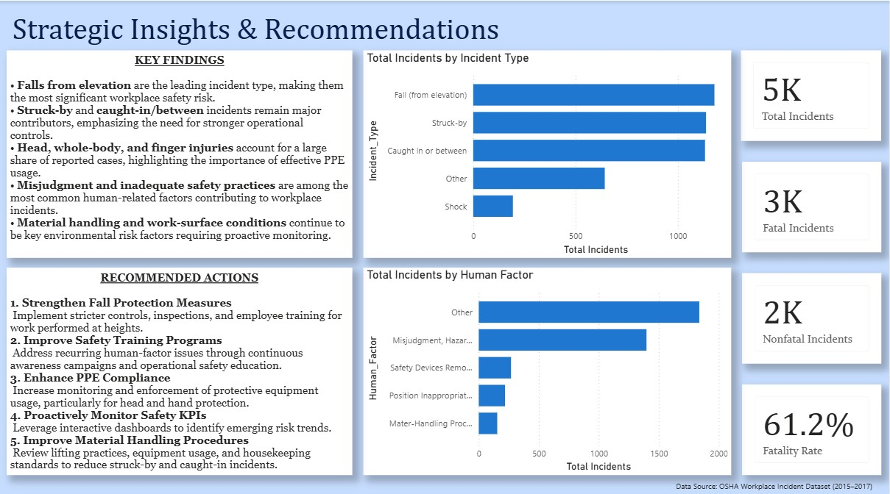

# 🛡️ Workplace Safety & HSE Analytics Dashboard

An interactive **Power BI dashboard** developed using OSHA workplace incident data to analyze workplace safety trends, injury severity, environmental risk factors, and human contributing factors. The dashboard supports **data-driven decision-making** through KPI tracking, trend analysis, and executive-level insights.

---

## 📊 Tools & Technologies

- Microsoft Power BI
- DAX
- Power Query
- Microsoft Excel

---

## 📌 Dashboard Overview

The dashboard is organized into four analytical pages:

### 1️⃣ Executive Overview

Provides a high-level summary of workplace safety performance through KPI cards and trend analysis.

---

### 2️⃣ Incident Analysis

Analyzes incident types, injury categories, environmental risks, body parts affected, and human contributing factors.

---

### 3️⃣ Risk Patterns & Severity Analysis

Examines relationships between incident severity, environmental conditions, and human factors to identify operational risks.

---

### 4️⃣ Strategic Insights & Recommendations

Summarizes key findings and provides actionable recommendations to improve workplace safety performance.

---

## 📈 Key Performance Indicators

- Total Incidents
- Fatal Incidents
- Nonfatal Incidents
- Fatality Rate

---

## 🔍 Key Insights

- Falls from elevation are the leading workplace incident type.
- Struck-by and caught-in/between incidents remain significant contributors.
- Head and finger injuries account for a substantial proportion of reported cases.
- Misjudgment and unsafe practices continue to influence workplace incidents.
- Material handling and work-surface conditions are major environmental risk factors.

---

## 💡 Business Value

This dashboard enables organizations to:

- Monitor workplace safety KPIs in real time.
- Identify recurring incident patterns.
- Analyze environmental and human risk factors.
- Support proactive safety planning through data-driven insights.

---

## 📂 Data Source

OSHA Workplace Incident Dataset (2015–2017)

---

⭐ Developed using **Microsoft Power BI** as part of a data analytics portfolio project.
